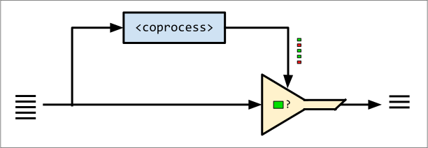
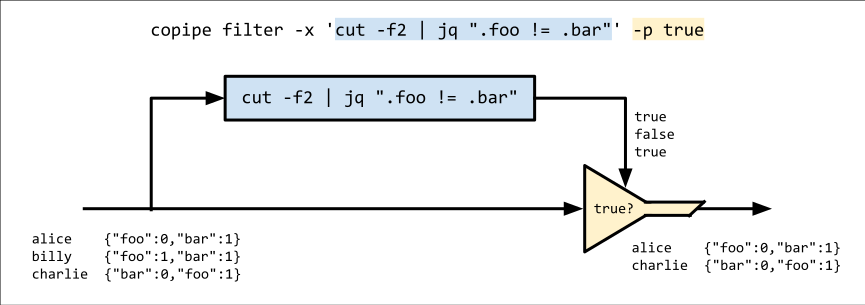
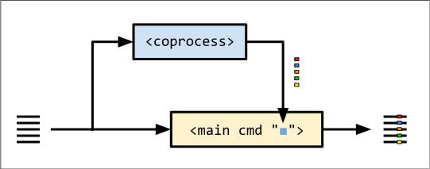
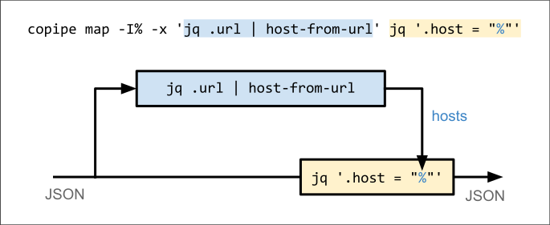
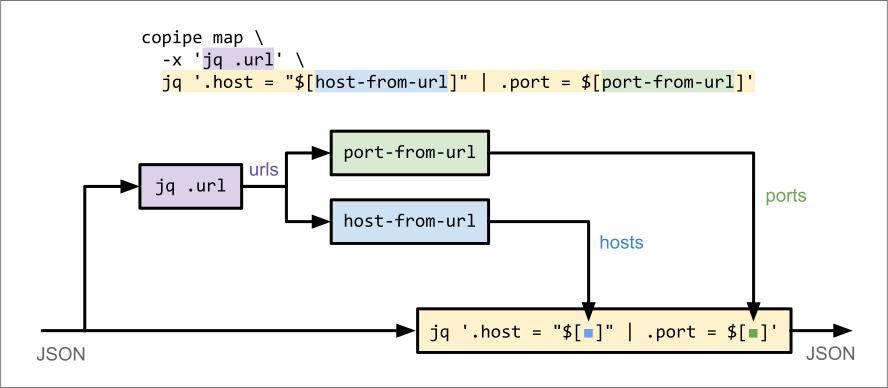

# copipe


copipe is a line-based text-processing utility that fills a gap between tools like
sed, awk, grep, and xargs. It enables the use of one or more
[coprocesses](https://en.wikipedia.org/wiki/Coprocess) to filter or modify a text
stream.

Coprocesses are underused in pipelines, probably because there is not an easy way to
use them. You can do it with
[gawk](https://www.gnu.org/software/gawk/manual/html_node/Two_002dway-I_002fO.html)
or bash's [coproc
builtin](https://www.gnu.org/software/bash/manual/html_node/Coprocesses.html), but
these are obscure features and frankly not very easy to use.

copipe shines in these situations:
- your data contains a mixture of encodings, e.g. base64 in TSV
- you have a filter mangles lines, but you need to preserve them
- you're using xargs or awk to process lines in subprocesses, but would prefer not to
  pay the cost of spawning a new process for every line

### Background: Side-Chaining
The idea is borrowed from an audio mixing technique called
[side-chaining](https://en.wikipedia.org/wiki/Dynamic_range_compression#Side-chaining)
in which an effect applied to one audio signal is controlled by an auxiliary signal.

For example, you might run a bass guitar channel through a compressor controlled by a
kick drum channel. In this setup, the bass ducks out of the way on every kick drum
hit, making for a cleaner, punchier mix.

The auxiliary signal doesn't need to be from a different instrument. It could be a
filtered copy of the main signal. For example, a simple technique for [de-essing
vocals](https://en.wikipedia.org/wiki/De-essing#Side-chain_compression_or_broadband_de-essing)
is to use a compressor triggered by a high-pass-filtered copy of the vocal channel.

#### Side-Chaining in Unix Pipelines
In a data pipeline, we can use this technique to control our primary data path using
a co-process.



## Filter Mode
When filtering data with a pipeline, you often need to trim lines so that they can be
parsed by a program. But occasionally, you end up trimming away important information
that can't be conveniently recovered.

### Example
Imagine we have lines of JSON-in-TSV:
```txt
# input.tsv
alice	{"foo":0,"bar":1}
billy	{"foo":1,"bar":1}
charlie	{"bar":0,"foo":1}
```
We want to filter this data to produce a list of users who have `.foo != .bar`. We
could use:
```bash
$ cut -f2 input.tsv | jq -c 'select(.foo != .bar)'
{"foo":0,"bar":1}
{"bar":0,"foo":1}
```
...but then we'd lose the usernames.

With `copipe filter`, you get to keep your original data, even if you use a
line-mangling filter.

#### Solution with copipe
```bash
$ copipe filter -x 'cut -f2 | jq ".foo != .bar"' -p true < input.tsv
alice	{"foo":0,"bar":1}
charlie	{"bar":0,"foo":1}
```
Arguments:
* `-x 'cut -f2 | jq ".foo != bar"'`: the coprocess; this happens to print `true` when `.foo != .bar`.
* `-p true`: output only those lines that match the pattern `true`.



Here, we're telling copipe to start the coprocess, pipe each line to it, and look for
the pattern `true` in its output. Matching lines are emitted **in their original,
unmangled form.**

Note: the coprocess is **spawned only once**. It's a long-running program that
handles all input lines. Contrast this with a solution in `awk` or `bash`, which
would require invoking `jq` separately for every input line.

## Map Mode
In map mode, the coprocess generates values which can be injected back into the main
pipeline.



### Example
Suppose you have a file containing lines of JSON with a field called `"url"`. You
want to extract the host component of each record's URL and stick it in a new field
called `"host"`.

```json
{"name":"alice","url":"https://foo.com"}
{"name":"billy","url":"http://1.2.3.4:8000/api"}
```

It's not hard to extract the host from a URL. But how would you do it reliably for
URLs embedded in JSON?

#### Solution with copipe
For readability, let's use an imaginary tool called `host-from-url` to extract the
hosts. In reality, you could use the Ruby one-liner
`ruby -r uri -ne 'u = URI($_.chomp); puts(u.host || "")'` (this reads from stdin and
processes all lines with a single invocation).

```bash
< input.json copipe map -I% -x 'jq .url | host-from-url' jq '.host = "%"'

#                           ^-------- coprocess -------^ ^-- main cmd --^
```
Like with xargs, we can use `-I <replstr>` to define a placeholder for the values
generated by the coprocess.



Here, the coprocess `jq .url | host-from-url` extracts the hosts, which are then
inserted into the output of the main command, `jq '.host = "%"'`.

Remember, the coprocess and main commands are both long-running processes. They are
not invoked for every line, as xargs would do.

## Using `$[]`
For cleaner, more-intuitive interpolation, you can use `$[]` to embed your coprocess
command in your main one:

```bash
copipe map jq '.host = "$[jq .url | host-from-url]"' < input.json

#                       ^------- coprocess ------^
#        ^------------- main command ------------^
```


This has the same behavior as the `-I%` version; it's just another way to spell it.

## Multiple Coprocesses
Map mode supports the use of _multiple coprocesses_.

Continuing with the URL-parsing example, imagine you want to extract the port from
the URL as well. Again, we'll use a placeholder (`port-from-url`) instead of a real
command that extracts ports from URLs.

```bash
copipe map jq '
    .host = "$[jq .url | host-from-url]"
  | .port =  $[jq .url | port-from-url]
' < input.json
```


This is great, but it duplicates some work: we're running two copies of `jq .url`.

To prevent this, you can insert a preliminary coprocess that feeds into the
downstream ones:

```bash
copipe map \
  -x 'jq .url' \
  jq '.host = "$[host-from-url]" | .port = $[port-from-url]' \
  < input.json
```


