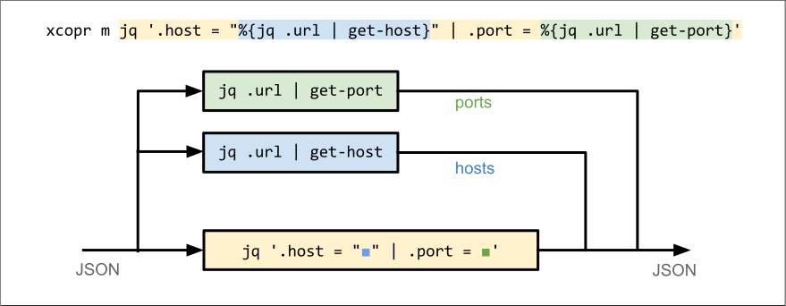
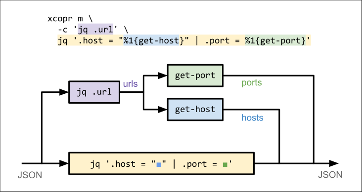

# xcopr


xcopr adds ergonomic **coprocessing** to the classic Unix toolkit.

Like xargs, xcopr plays a supporting role, allowing users to compose familiar tools
more easily.

Unlike xargs, xcopr is focused primarily on data streams: it empowers users to split
and rejoin them, increasing the reach of shell-based stream processing.

## What is a coprocess?
A coprocess runs in parallel with a main process and communicates bidirectionally
with it.

Coprocesses are often overlooked in shell pipelines, understandably so: it's not easy
to use them that way.
[Bash](https://www.gnu.org/software/bash/manual/html_node/Coprocesses.html),
[ksh](https://www.ibm.com/docs/en/aix/7.1?topic=shell-coprocess-facility), and
[gawk](https://www.gnu.org/software/gawk/manual/html_node/Two_002dway-I_002fO.html)
have coprocessing features, but they are too verbose to serve as pipeline building
blocks in practice.

Whereas xargs forks a new process for each input line, xcopr spins up a long-lived
coprocess, pipes data to it, and merges its output into the main data path in a
user-specified way.

## What is xcopr for?
xcopr shines in these situations:
- your data contains a mixture of encodings (e.g., base64 in TSV)
- you want to use a line-mangling filter (like cut or jq) but need to preserve the
  original lines for later use
- you're using xargs or awk to run subprocesses, but don’t want to fork a new process
  per line
- you want compose tools in a seemingly-impossible way (e.g., splitting a pipeline
  into multiple branches)

# Modes
## `xcopr filter`
When filtering data with a pipeline, you often need to trim lines so that they can be
parsed. But sometimes, the filter trims away important information needed for later
processing.

In filter mode, xcopr sends each input line to a coprocess whose output is used to
determine whether the original line passes through.


### Example
Imagine we have lines of JSON-in-TSV:
```txt
# input.tsv
alice	{"foo":0,"bar":1}
billy	{"foo":1,"bar":1}
charlie	{"bar":0,"foo":1}
```
We want to filter this data to produce a list of users who have `.foo == .bar`. We
could use:
```bash
$ cut -f2 | jq -c 'select(.foo == .bar)' < input.tsv
{"foo":1,"bar":1}
```
...but then we'd lose the usernames. With xcopr, we get to keep the original data by
isolating the line-mangling to a coprocess.

#### Solution with `xcopr filter`
(`xcopr f`, for short)
```bash
$ xcopr f -c 'cut -f2 | jq ".foo == .bar"' -e true < input.tsv
billy	{"foo":1,"bar":1}
```
Arguments:
* `-c 'cut -f2 | jq ".foo == .bar"'`: the coprocess; this happens to print `true`
  when `.foo == .bar`.
* `-e true`: output lines whose coprocess output matches the pattern `true`.


Here, we're telling xcopr to start the coprocess, pipe each line to it, and look for
the pattern `true` in its output. Matching lines are emitted **in their original,
unmangled form.**

Remember: the coprocess is **spawned only once**. It's a long-running program that
handles all input lines. Contrast this with a traditional shell loop, which would
invoke `jq` separately for every line.

## `xcopr map`
In map mode, the coprocess generates values which can be injected back into the main
process's output.


### Example
Consider the following newline-delimited JSON data:
```json
{"name":"alice","url":"https://foo.com"}
{"name":"billy","url":"http://1.2.3.4:8000/api"}
...
```
Suppose you want to extract the host component of each record's URL and stick it in a
new field called `"host"`:
```json
{"name":"alice","url":"https://foo.com","host":"foo.com"}
{"name":"billy","url":"http://1.2.3.4:8000/api","host":"1.2.3.4"}
...
```
It's not hard to extract the host from a URL. But how would you do it reliably for
URLs embedded in JSON?

Note: for readability, let's assume we have a program called `get-host` to extract
the hosts. You could implement this as a Ruby one-liner:
```bash
# reads from stdin and processes all lines before exiting
ruby -r uri -ne 'puts(URI($_.chomp).host || "")'
```

#### Solution with `xcopr map`
The following command uses a coprocess to generate the stream of hosts, then inserts
them back into the main output stream:
```bash
xcopr m -c 'jq .url | get-host' -- jq '.host = "\1"' < input.json
```
Notes:
* `-c 'jq .url | get-host'` is the coprocess; this outputs the host component
  extracted from each JSON record's `"url"` field.
* `\1`: like in sed, this is a special placeholder for injecting values into the
  output stream. In this case, the values are the lines emitted by the coprocess.


The coprocess `jq .url | get-host` extracts the hosts, which are then inserted
into the output of the main command, `jq '.host = "\1"'`.

## Using `${}`
As an alternative to using `-c`, you may use `${}` to embed your coprocess command in
your main one:

```bash
xcopr m jq '.host = "${jq .url | get-host}"' < input.json
```


This has the same behavior as the `-c` version; it's just another way to write it.

Note: to pass a literal dollar sign (e.g., to let the shell perform variable
expansion), use `$$`.

## Multiple Coprocesses
Map mode supports **multiple coprocesses**.

Continuing with the URL-parsing example, imagine you want to extract the port from
the URL as well. Again, we'll use an imaginary tool, `get-port`, instead of a
real command.
```bash
xcopr m \
  -c 'jq .url | get-host' \
  -c 'jq .url | get-port' \
  jq '.host = "\1" | .port = \2' \
  < input.json
```
We use `\1` and `\2` to refer to the 1st and 2nd coprocesses, in the order they were
specified.

Or, using `${}`:

```bash
xcopr m \
  jq '.host = "${jq .url | get-host}" | .port = ${jq .url | get-port}' \
  < input.json
```



Notice that this duplicates some work: we're running two copies of `jq .url`.

This is totally fine in this case, but if your workload involves expensive redundant
processing, you can eliminate it by connecting one coprocess to multiple downstream
ones:

```bash
xcopr m \
  -c 'jq .url' \
  -c '$1{get-host}' \
  -c '$1{get-host}' \
  jq '.host = "\2" | .port = \3' \
  < input.json
```
Here, the `$n{}` syntax is used to connect one coprocess to another; `n` is the ID of
the upstream coprocess.

Equivalently:
```bash
xcopr m \
  -c 'jq .url' \
  jq '.host = "$1{get-host}" | .port = $1{get-host}' \
  < input.json
```


