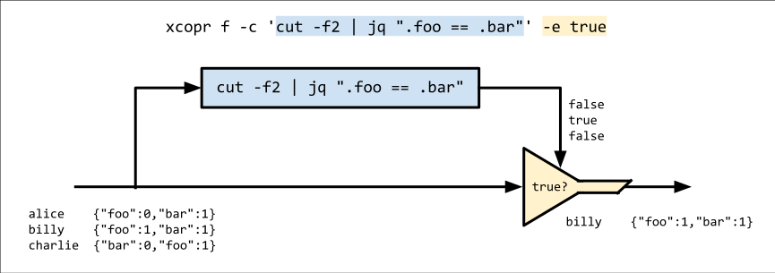
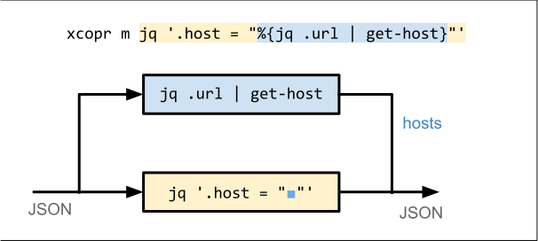

# xcopr


xcopr is a text-processing utility that fills a gap in the standard command-line
toolset: it can split and rejoin pipelines by utilizing **coprocesses**.

A coprocess runs in parallel with a main process and communicates bidirectionally
with it. Coprocesses are often overlooked when composing stream-processing pipelines
in the shell, understandably so: there's no easy way to use them that way.
[Bash](https://www.gnu.org/software/bash/manual/html_node/Coprocesses.html) and
[gawk](https://www.gnu.org/software/gawk/manual/html_node/Two_002dway-I_002fO.html)
have coprocessing features, but both are too verbose and awkward to be used as
pipeline building blocks in practice.

xcopr shines in these situations:
- Your data contains a mixture of encodings, e.g. base64 in TSV
- You want to use a filter that mangles lines (e.g. with cut, sed, etc.) but need to
  preserve the original lines for the output or next stage of processing
- You're using xargs or awk to run subprocesses, but don’t want to spawn a new
  process for every line

## `xcopr filter`
When filtering data with a pipeline, you often need to trim lines so that they can be
parsed. But occasionally, you end up trimming away important information that can't
be conveniently recovered.

In filter mode, the coprocess receives one line at a time on stdin, and its output is
used to determine whether the original line should be passed through.


### Example
Imagine we have lines of JSON-in-TSV:
```txt
# input.tsv
alice	{"foo":0,"bar":1}
billy	{"foo":1,"bar":1}
charlie	{"bar":0,"foo":1}
```
We want to filter this data to produce a list of users who have `.foo != .bar`. We
could use:
```bash
$ cut -f2 | jq -c 'select(.foo != .bar)' < input.tsv
{"foo":0,"bar":1}
{"bar":0,"foo":1}
```
...but then we'd lose the usernames. With xcopr, we get to keep the original data by
delegating the line-mangling to a coprocess.

#### Solution with `xcopr filter`
(`xcopr f`, for short)
```bash
$ xcopr f -x 'cut -f2 | jq ".foo != .bar"' -p true < input.tsv
alice	{"foo":0,"bar":1}
charlie	{"bar":0,"foo":1}
```
Arguments:
* `-x 'cut -f2 | jq ".foo != .bar"'`: the coprocess; this happens to print `true`
  when `.foo != .bar`.
* `-p true`: output original lines whose coprocess output matches the pattern `true`.



Here, we're telling xcopr to start the coprocess, pipe each line to it, and look for
the pattern `true` in its output. Matching lines are emitted **in their original,
unmangled form.**

Remember: the coprocess is **spawned only once**. It's a long-running program that
handles all input lines. Contrast this with a traditional shell loop, which would
invoke `jq` separately for every input line.

## `xcopr map`
In map mode, the coprocess generates values which can be injected back into the main
process's output.


### Example
Suppose you have a file containing lines of JSON with a field called `"url"`. You
want to extract the host component of each record's URL and stick it in a new field
called `"host"`.

```json
{"name":"alice","url":"https://foo.com"}
{"name":"billy","url":"http://1.2.3.4:8000/api"}
```

It's not hard to extract the host from a URL. But how would you do it reliably for
URLs embedded in JSON?

#### Solution with `xcopr map`
(`xcopr m`, for short)
For readability, let's use an imaginary tool called `host-from-url` to extract the
hosts. In reality, you could use the Ruby one-liner
`ruby -r uri -ne 'u = URI($_.chomp); puts(u.host || "")'` (this reads from stdin and
processes all lines with a single invocation).

```bash
xcopr m -I% -x 'jq .url | host-from-url' jq '.host = "%"' < input.json

#               ^----- coprocess -----^
```
Arguments:
* `-I%`: like with xargs, this defines a placeholder string (`%` in this example) for
  the values generated by the coprocess.
* `-x 'jq .url | host-from-url'`: the coprocess; this outputs the host component
  extracted from each JSON record's `"url"` field.


The coprocess `jq .url | host-from-url` extracts the hosts, which are then inserted
into the output of the main command, `jq '.host = "%"'`.

## Using `$[]`
For cleaner, more-intuitive interpolation, you can use `$[]` to embed your coprocess
command in your main one:

```bash
xcopr m jq '.host = "$[jq .url | host-from-url]"' < input.json

#                        ^----- coprocess -----^
```



This has the same behavior as the `-I%` version; it's just another way to write it.

## Multiple Coprocesses
Map mode supports **multiple coprocesses**.

Continuing with the URL-parsing example, imagine you want to extract the port from
the URL as well. Again, we'll use an imaginary tool, `port-from-url`, instead of a
real command.

```bash
xcopr m jq '
    .host = "$[jq .url | host-from-url]"
  | .port =  $[jq .url | port-from-url]
' < input.json
```


This is great, but it duplicates some work: we're running two copies of `jq .url`.

If you want to avoid this, you can insert a preliminary coprocess that feeds into the
downstream ones:

```bash
xcopr m \
  -x 'jq .url' \
  jq '.host = "$[host-from-url]" | .port = $[port-from-url]' \
  < input.json
```


